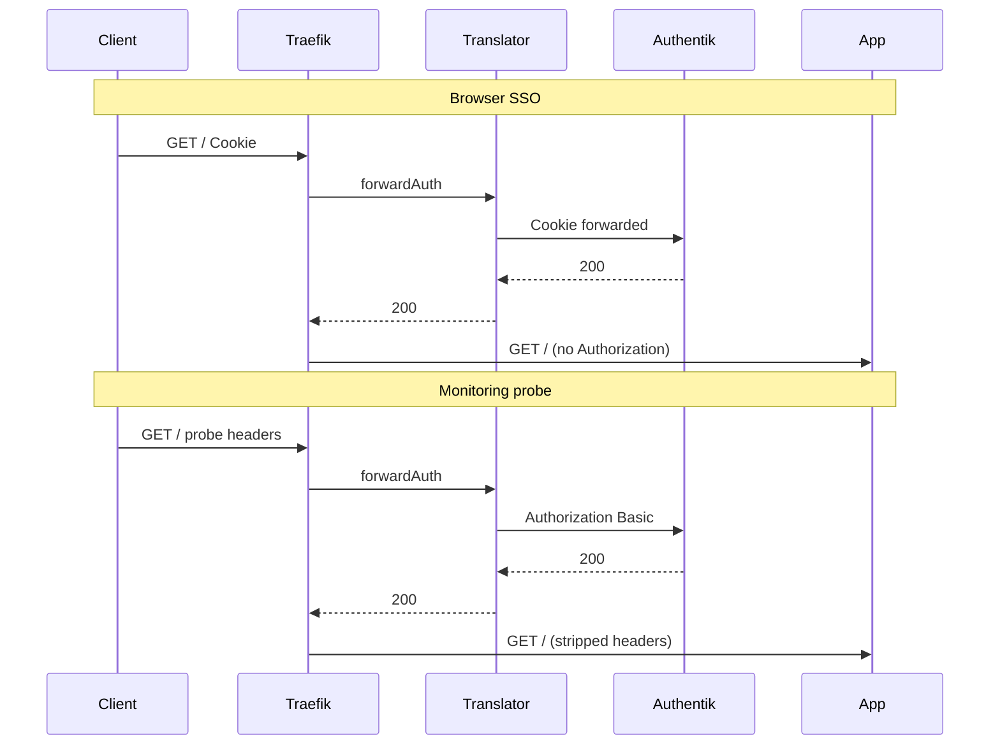

# forward-auth-translator

Thin HTTP adapter for [Traefik forward authentication](https://doc.traefik.io/traefik/middlewares/http/forwardauth/) in front of [Authentik](https://goauthentik.io/) proxy providers with `intercept_header_auth` enabled.

Monitoring tools such as [Gatus](https://github.com/TwiN/gatus) can send custom probe headers (`Gatus-Probe-Client-Id` / `Gatus-Probe-Client-Secret`) instead of `Authorization: Basic`, which would otherwise leak credentials to backend applications. This service translates those headers into `Authorization: Basic` for the Authentik outpost subrequest only.

## What it does

- Accepts Traefik `forwardAuth` subrequests at `GET /auth/traefik`
- When **both** probe ID and secret headers are present, rewrites them to `Authorization: Basic base64(id:secret)` and strips the probe headers before calling Authentik
- Otherwise proxies the subrequest unchanged (browser cookie SSO path)
- Returns Authentik's status, headers, and body verbatim

## What it does not do

- It is **not** an authentication server
- It **never** returns `200` without a successful upstream response
- It stores no credentials (probe secrets exist only in request memory)

## Architecture



Pair with a Traefik middleware that strips `Authorization` and probe headers **after** forward-auth so backends never see them.

## Configuration

| Variable | Default | Required | Purpose |
|----------|---------|----------|---------|
| `LISTEN_ADDR` | `:8080` | No | HTTP listen address |
| `AUTHENTIK_OUTPOST_URL` | — | **Yes** | Full Authentik outpost URL (scheme + host + path) |
| `PROBE_ID_HEADER` | `Gatus-Probe-Client-Id` | No | Probe username header name |
| `PROBE_SECRET_HEADER` | `Gatus-Probe-Client-Secret` | No | Probe password header name |

`AUTHENTIK_OUTPOST_URL` has no default in source. Set it at runtime (for example in your Kubernetes Deployment).

Example:

```text
AUTHENTIK_OUTPOST_URL=http://authentik-outpost.identity.svc.cluster.local/outpost.goauthentik.io/auth/traefik
```

## Endpoints

| Path | Method | Description |
|------|--------|-------------|
| `/auth/traefik` | `GET`, `HEAD` | Traefik forwardAuth target |
| `/healthz` | `GET`, `HEAD` | Liveness / readiness (`200 ok`) |

## Local development

```bash
# Terminal 1 — mock Authentik outpost
python3 -m http.server 9000

# Terminal 2 — translator
export AUTHENTIK_OUTPOST_URL=http://127.0.0.1:9000/outpost.goauthentik.io/auth/traefik
go run ./cmd/forward-auth-translator
```

### Example curl (probe path)

```bash
curl -sS -D - -o /dev/null \
  -H 'Gatus-Probe-Client-Id: monitoring-probe' \
  -H 'Gatus-Probe-Client-Secret: example-app-password' \
  -H 'X-Forwarded-Uri: https://app.example.internal/' \
  -H 'X-Forwarded-Method: GET' \
  http://127.0.0.1:8080/auth/traefik
```

## Kubernetes

See [`examples/kubernetes/deployment.yaml`](examples/kubernetes/deployment.yaml) for a generic Deployment + Service sample (placeholder namespace `ingress`, fictional service names).

Published image:

```text
ghcr.io/rohankapoorcom/forward-auth-translator:main
```

Pin by digest in production GitOps.

## Security

See [SECURITY.md](SECURITY.md).

## License

[MIT](LICENSE)
